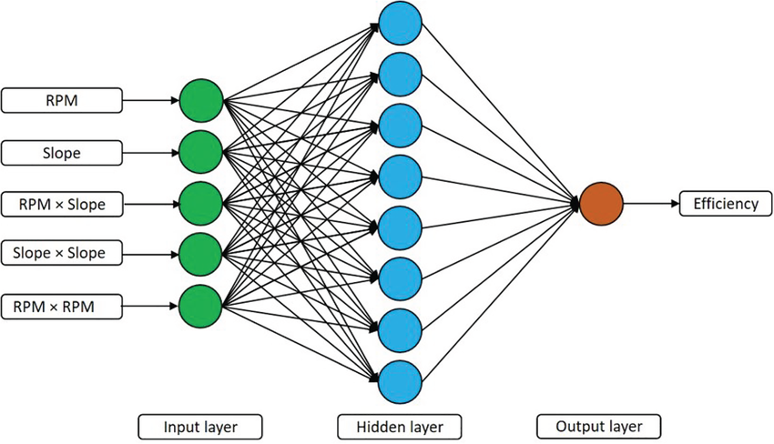

# Number Detection using Neural Network
- This model can be used for OCR to detect the number

## ANN Architecture used for building OCR

## Author
Raj Jagannath Nangare  
MTech Information Security  
NIT Allahabad 2027